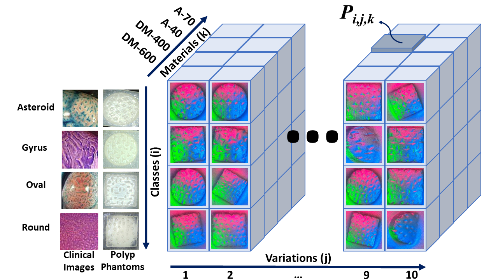
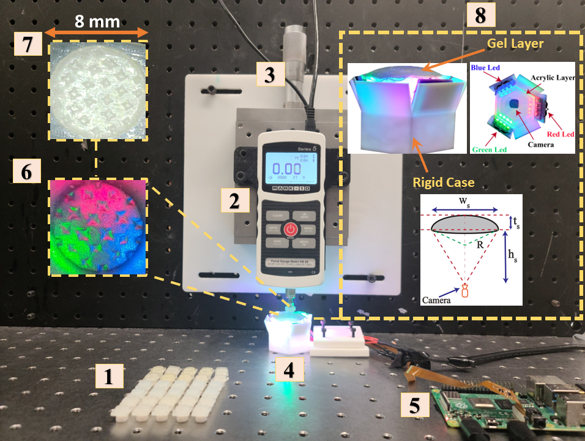
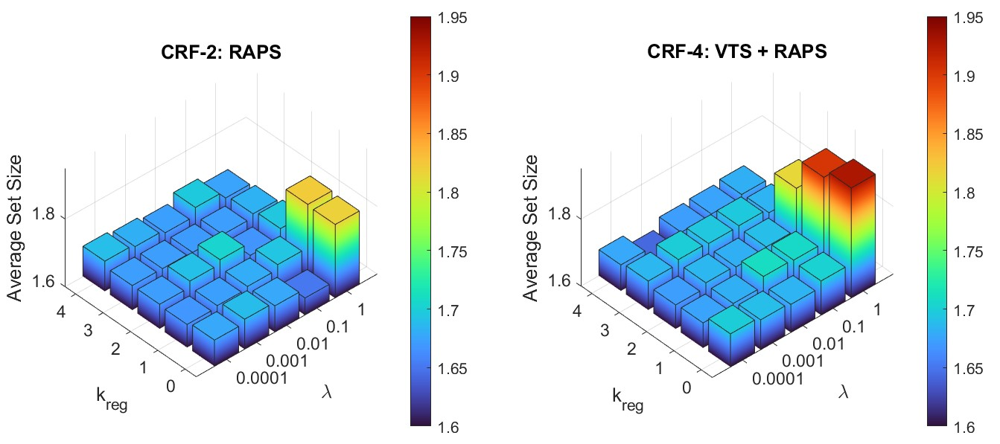
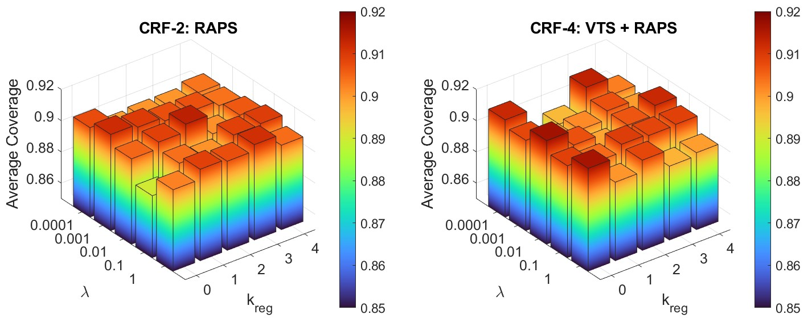

# cascade-reliability-framework
Supplementary material for the JBHI paper titled "A Novel Dual Layer Cascade Reliability Framework for an Informed and Intuitive Clinician-AI Interaction In Diagnosis of Colorectal Cancer Polyps".

## Dataset

<!--  -->
Without loss of generality, to train the deep learning models used in this work and assess the proposed Cascade Reliability Framework (CRF) architecture, we fabricated realistic synthetic CRC polyp phantoms to generate a custom dataset using our novel Vision-Based Tactile Sensor (VS-TS) HySenSe. This was done since the textural images generated by our sensor differ significantly from publicly available medical datasets. 

This figure shows the images of the real CRC polyp types as well as the fabricated phantoms replicating them. These polyps are classified based on Kudo pit patterns, such as Asteroid, Gyrus, Round, and Oval. Also, a conceptual three-dimensional illustration of the textural image dataset collected by the HySenSe VTS on  10 variations of 3D printed polyp phantoms is shown in the figure.  Each of the polyp phantoms is printed with 4 different materials (i.e., DM-400, DM-600, A-40, and A-70). 

The dataset used in this study is also available to view and use in this repository.

## Experimental Setup

This figure shows the experimental setup for collecting textural images using the HyySense VTS and polyp phantoms, including: (1): CRC polyp phantoms, (2): Mark-10 Series 5 Digital Force Gauge, (3): M-UMR12.40 Precision Linear Stage, (4): HySenSe sensor, (5): Raspberry Pi 4 Model B, (6): HySenSe image output, (7): Dimensions of polyp phantom, (8): HySenSe side view, top view, and dimensions, hs = 24 mm is the height of the 3D printed rigid frame, ts = 4.5 mm is the thickness of the gel layer ws = 33.8 mm is the width of the gel layer, and R = 35 mm is the radius of the dome-shaped gel layer.

The HySenSe sensor itself consists of (i) a deformable silicone membrane that directly interacts with the target surface, (ii) an optical module (Arducam 1/4 inch 5 MP camera), that captures the minute deformations of the gel layer in case of interaction with a texture, (iii) a transparent acrylic plate providing support to the gel layer, (iv) an array of Red, Green and Blue LEDs to provide internal illumination for depth perception, and (v) a rigid frame supporting the entire structure.

## Choice of Hyperparameters for the RAPS Algorithm

In our paper, we compare the use of two conformal prediction algorithms: Naive Conformal Prediction (NCP) and Regularized Adaptive Predictive Sets (RAPS). While the NCP approach does not have any parameters that need to be tuned, this is not the case for the RAPS. The RAPS algorithm has two parameters (i.e., $\lambda$ and $k_{reg}$) that need to be optimally tuned. To find such an optimal set of parameters, we performed a sensitivity analysis study. Figure \ref{fig:hyperparams} shows exemplary cases of evaluating the performance of the Dilated ResNet model integrated with the two  CRF models utilizing RAPS (i.e., CRF-2 and CRF-4) in terms of coverage and average set size for all combinations of $\lambda\in$ \{0.0001, 0.001, 0.01, 0.1, 1\} and $k_{reg}\in$ \{0, 1, 2, 3, 4\}. All values are reported by averaging 100 trials for each of the 25 combinations. The figures below show the results of these 2500 experiments. 

As can be observed, although convergence of the RAPS approach is independent of the tuning parameters (i.e., $\lambda$ and $k_{reg}$) and for all performed experiments the algorithm always converges, certain combinations can lead to larger predictive sets than the others. We would like to avoid this, as larger average predictive set sizes can lead to a loss in interpretability. In other words, in such cases, it becomes more likely that the model outputs two or three types of tumors for every prediction regardless of the associated confidences, thus making the decision-making very difficult and uncertain. 
Also, no discernable trends are found for average coverage  over the hyperparameter space. Nevertheless, choosing a higher value of $\lambda$ along with an early cutoff parameter $k_{reg}$ of 0 or 1 leads to much larger average set sizes than for other combinations, which have mostly similar performance. Therefore, for the rest of our analysis in this paper, we fixed the hyperparameters at $\lambda$ = 0.1 and $k_{reg} = 1$. Note that at this combination, the CRF models are able to reach an average coverage of 0.905, while keeping the average set size at 1.7. 

## Results Tables 

For Dilated ResNet: 

| CRF Model        | Base Model Accuracy | Coverage | Average Set Size | Asteroid | Gyrus | Oval | Round |
|------------------|---------------------|----------|------------------|----------|-------|------|-------|
| **Error Rate ($\alpha$) = 20%**  |
| CRF-1: NCP       | 0.8015              | 0.8043   | 1.0100           | 0.8672   | 0.7162| 0.6796| 0.9989|
| CRF-2: RAPS      | 0.8020              | 0.8007   | 1.1843           | 0.8866   | 0.6932| 0.7306| 0.9113|
| CRF-3: VTS + NCP | 0.7998              | 0.8090   | 1.0228           | 0.8880   | 0.6909| 0.6856| 0.9989|
| CRF-4: VTS + RAPS| 0.8030              | 0.7995   | 1.2087           | 0.8746   | 0.6789| 0.7318| 0.9392|
| **Error Rate ($\alpha$) = 10%** |
| CRF-1: NCP       | 0.7858              | 0.9023   | 1.5125           | 0.9978   | 0.7954| 0.8457| 1.0000|
| CRF-2: RAPS      | 0.7857              | 0.9055   | 1.7065           | 0.9693   | 0.8314| 0.8403| 1.0000|
| CRF-3: VTS + NCP | 0.7831              | 0.9005   | 1.5175           | 0.9911   | 0.7980| 0.8375| 1.0000|
| CRF-4: VTS + RAPS| 0.8032              | 0.9082   | 1.6008           | 0.9868   | 0.8469| 0.8222| 1.0000|
| **Error Rate ($\alpha$) = 1%** |
| CRF-1: NCP       | 0.7842              | 0.9935   | 3.1623           | 1.0000   | 0.9770| 1.0000| 1.0000|
| CRF-2: RAPS      | 0.7844              | 0.9945   | 2.92275          | 1.0000   | 0.9921| 0.9843| 1.0000|
| CRF-3: VTS + NCP | 0.7875              | 0.9963   | 3.2080           | 1.0000   | 0.9868| 1.0000| 1.0000|
| CRF-4: VTS + RAPS| 0.7856              | 0.9935   | 2.9085           | 1.0000   | 0.9914| 0.9833| 1.0000|

For ResNet18: 

| CRF Model        | Base Model Accuracy | Coverage | Average Set Size | Asteroid | Gyrus | Oval | Round |
|------------------|---------------------|----------|------------------|----------|-------|------|-------|
| **Error Rate ($\alpha$) = 20%**  |
|  CRF-1: NCP      | 0.7772              | 0.80825           | 1.0662            | 0.7092                   | 0.7854               | 0.7769             | 1                      |
| CRF-2: RAPS           | 0.8227              | 0.80275           | 1.044             | 0.7118                   | 0.8879               | 0.7206             | 0.8868                 |
| CRF-3: VTS + NCP      | 0.76818             | 0.80275           | 1.1027            | 0.7232                   | 0.8329               | 0.7258             | 1                      |
| CRF-4: VTS + RAPS     | 0.7909              | 0.806             | 1.1277            | 0.7374                   | 0.8409               | 0.7451             | 0.9033                 |
| **Error Rate ($\alpha$) = 10%** |
| CRF-1: NCP             | 0.7772              | 0.91025           | 1.298             | 0.8128                   | 0.9723               | 0.8661             | 1                      |
|  CRF-2: RAPS            | 0.8227              | 0.9065            | 1.2345            | 0.8362                   | 0.9817               | 0.8285             | 0.9866                 |
|CRF-3: VTS + NCP      | 0.8272              | 0.90149           | 1.22075           | 0.7987                   | 0.9579               | 0.8656             | 1                      |
| CRF-4: VTS + RAPS    | 0.7909              | 0.90225           | 1.3615            | 0.8323                   | 0.9308               | 0.8835             | 0.9761                 |
| **Error Rate ($\alpha$) = 1%** |
| CRF-1: NCP             | 0.7772              | 0.99525           | 2.01825           | 0.9972                   | 1                    | 1                  | 0.9852                 |
|  CRF-2: RAPS            | 0.8227              | 0.9947            | 2.68425           | 0.986                    | 1                    | 0.9947             | 1                      |
| CRF-3: VTS + NCP       | 0.8272              | 0.99625           | 1.73725           | 0.9883                   | 1                    | 1                  | 1                      |
| CRF-4: VTS + RAPS     | 0.8227              | 0.9944            | 2.5367            | 0.9854                   | 1                    | 0.9922             | 1                      |

## Bibliography
1. [HySenSe: A Hyper-Sensitive and High-Fidelity Vision-Based Tactile Sensor](https://link.springer.com/article/10.1007/s10439-023-03153-w), by Ozdemir Can Kara, Naruhiko Ikoma & Farshid Alambeigi (2022)
2. [A Reliable and Sensitive Framework for Simultaneous Type and Stage Detection of Colorectal Cancer Polyps](https://link.springer.com/article/10.1007/s10439-023-03153-w), by Ozdemir Can Kara, Nethra Venkatayogi, Naruhiko Ikoma & Farshid Alambeigi (2023)
